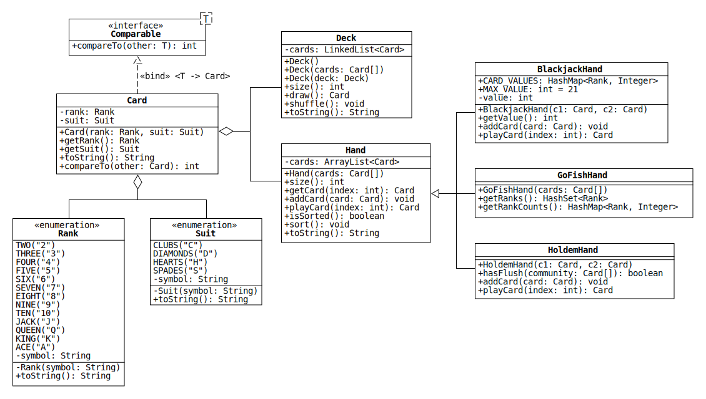

# Lab 8: Collections of Cards

In this lab, we will leverage the [Java collections framework](https://docs.oracle.com/en/java/javase/11/docs/api/java.base/java/util/doc-files/coll-overview.html) to write classes that represent collections of playing cards in various games.
Additionally, we will use enumerated types to represent the rank and suit of each card.
Below is a UML diagram with the details:

## Javadoc

Beginning with Project 3, you will use Javadoc to document your code instead of writing a separate readme file.
To practice this, we're going to use Javadoc in this assignment.
Please read Cameron's excellent [Javadoc tutorial](./Javadoc.md) to get started.

## Rank and Suit Enums

Enumerated types can be used to represent the ranks and suits in a [standard 52-card deck](https://en.wikipedia.org/wiki/Standard_52-card_deck) of playing cards.
Take a look at [this short section](https://docs.oracle.com/javase/tutorial/java/javaOO/enum.html) of the Oracle Java tutorials before trying to implement them.

* `toString()`: Returns the string representation of the value of the enum, which is stored in the field `symbol`.

## Card

The Card class represents a card in a standard 52-card deck.
Each Card object contains a Rank and a Suit.

* `toString()`: Returns the concatenation of the string representations of the rank and suit.
For example, if the card is the nine of spades, the method returns "9S".

* `compareTo()`: Defines the default order of a collection of cards.
Implement the method so that a list of cards is sorted first by suit and then by rank.

## Deck

The Deck class represents a deck of standard playing cards.
Deck objects contain a private [LinkedList](https://docs.oracle.com/en/java/javase/11/docs/api/java.base/java/util/LinkedList.html) that stores Card objects.
A LinkedList is used instead of an ArrayList because the methods of Deck only need to access to the first card in the list.

* `Deck()`: Creates a new 52-card deck in sorted order.

* `Deck(Card[] cards)`: Creates a partial deck from the cards in the given array.

* `Deck(Deck deck)`: Creates a copy of the given deck.
(This is known as a "copy constructor.")
The new deck has its own copy of the LinkedList `cards`.

* `draw()`: Removes and returns the first card in `cards`.

* `shuffle()`: Randomizes the order of the cards in `cards`.
(Hint: use a method of the Collections class.)

The methods `size` and `toString` simply call the corresponding methods of the LinkedList `cards`.

## Hand

The Hand class represents a player's cards in a generic card game.
Hand objects contain a private [ArrayList](https://docs.oracle.com/en/java/javase/11/docs/api/java.base/java/util/ArrayList.html) that stores Card objects.
An ArrayList is used because the methods of Hand require [random access](https://en.wikipedia.org/wiki/Random_access) to cards in the list.

* `Hand(Card[] cards)`: Creates a hand from the cards in the given array.

* `playCard(int index)`: Removes and returns the card with the given index in `cards`.

* `isSorted()`: Returns true if the elements of `cards` are in sorted order.
Otherwise, it returns false.

* `sort()`: Sorts `cards` into ascending order.
(Hint: use a method of the Collections class.)

The methods `size`, `getCard`, `addCard`, and `toString` simply call the corresponding methods of the ArrayList `cards`.

## BlackjackHand

BlackjackHand represents a hand of cards in a game of [Blackjack](https://en.wikipedia.org/wiki/Blackjack).

* `CARD_VALUES`: A [HashMap](https://docs.oracle.com/en/java/javase/11/docs/api/java.base/java/util/HashMap.html) that stores the value of each card.
Cards with a numerical rank have the same value as the number.
For example, the five of clubs is worth 5 points.
Face cards (jack, queen, and king) are each worth 10 points.
Aces are worth either 1 or 11 points; however, only the larger value is stored in the HashMap.

  Hint: use a [static initialization block](https://docs.oracle.com/javase/tutorial/java/javaOO/initial.html) to create the HashMap after declaring the `CARD_VALUES` field.

* `getValue()`: Returns the total value of all the cards in the hand.
If the hand contains aces, the method returns the largest value that is less than or equal to `MAX_VALUE`.
(For instance, if the hand contains two aces and an eight, the largest value is 20: one ace is counted as 11 and the other as 1.)
If this is not possible, the method returns the smallest value that is greater than `MAX_VALUE`.

  Hint: if the constructor and `addCard` are implemented correctly, then this method only needs to return the field `value`.

* `addCard(Card card)`: If the current value of the hand is less than or equal to `MAX_VALUE`, add the given card and update `value`.
Otherwise, do nothing.

  Hint: it may be useful to create a private field that stores the number of aces in the hand that are contributing 11 points to `value`.

* `playCard(int index)`: Cards cannot be removed from a Blackjack hand.
Override this method so that it always returns null.

## GoFishHand

GoFishHand represents a hand of cards in a game of [Go Fish](https://en.wikipedia.org/wiki/Go_Fish).

* `getRanks()`: Returns a [HashSet](https://docs.oracle.com/en/java/javase/11/docs/api/java.base/java/util/HashSet.html) with the ranks of all the cards in the hand.
(This method allows the player to easily answer the question, "Do you have any sevens?")

* `getRankCounts()`: Returns a HashMap with the number of cards in the hand with each rank.
(This method allows the player to easily check whether they've formed any books.)

## HoldemHand

HoldemHand represents a hand of cards in a game of [Texas hold 'em](https://en.wikipedia.org/wiki/Texas_hold_%27em).

* `hasFlush(Card[] community)`: Returns true if 5 or more cards in the hand and the given array have the same suit.
Otherwise, it returns false.

  Hint: create a HashMap with the number of cards in each suit.

* `addCard(Card card)`: Cards cannot be added to a Texas Hold 'em hand.
Override this method so that it does nothing.

* `playCard(int index)`: Cards cannot be removed from a Texas Hold 'em hand.
Override this method so that it always returns null.
